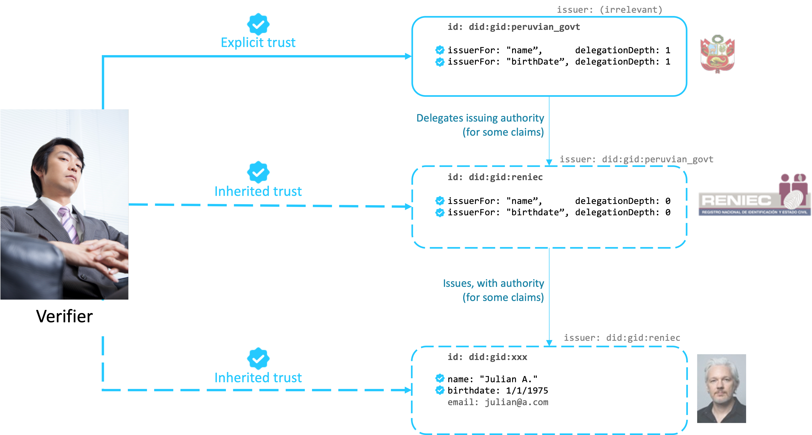

# Trusted Credentials

## Motivation

Verifiable credentials claim information about a subject. While it is possible for a verifier to deterministically check that a credential actually came from its listed issuer without modifications (integrity), the decision of whether to *trust* that content depends on the verifier's own context.

For example, a police officer in Germany might verify that a driving license from Canada is genuine, but that doesn't mean they can accept the Canadian government as a relevant authority and let you drive. That decision is up to the police and based e.g. on international agreements between countries.

In many cases, verifiers' criteria are as simple as recognizing a set of authorities for certain types of claims or credentials. Sometimes, more complex rules exist, such as a possibility to delegate trust. Such a setup is similar to the Public Key Infrastructure (PKI) for X.509 certificates, but nuanced by the type of information – e.g. the authorities for academic credentials are not the same as for citizenship or banking information.

## Definitions and concepts

### Issuing authority

That an entity has *issuing authority* for a type of information (e.g. identity document number, phone number, email address), means that verifiers will trust information of that type issued by that entity.

### Trusted information

A piece of information in a credential is trusted by a verifier if either:

- The verifier decides to trust that piece of information directly, based on their own rules (_explicit trust_).
- The verifier considers the issuer of the credential to have issuing authority for that piece of information (_inherited trust_).

### Delegation depth: Someone said that someone said that someone said...

In some contexts, an entity has the authority to issue credentials themselves but choose to delegate that authority to other entities.

**Examples:**

- A car reseller may attest to a car's functioning state but may not delegate that authority to another entity (authority with delegation depth 0).
- A car brand may give authority to car resellers to attest to a car's functioning state (delegation depth 1).
- A university may issue diplomas but may not delegate that authority (delegation depth 0).
- The Ministry of Education of a country may give authority to universities to issue diplomas (delegation depth 1).
- The government of a country may give authority to the Ministry of Education to give that authority to universities (delegation depth 2).

## Big picture

The following example illustrates a chain of trust where the verifier trusts the Peruvian government for credentials containing names and birth dates, and the government delegates that authority to Peruvian identity office "RENIEC". As a result, the verifier trusts the name and birthdate of a subject, but not their email, even if that information is present on the subject's ID card.



## Technical specification

See [schema.org issue #2854](https://github.com/schemaorg/schemaorg/issues/2854) for the proposed schema and discussion to implement chains of trust.

## Examples

### Example scenarios for explicit trust

1. An identity wallet may allow the user to manually trust a specific credential.
2. A verifier may choose to accept self-issued credentials (i.e. the subject is the issuer) for some types of claims or credentials.
3. _Big Buck Bank_ chooses to trust directly a specific financial institution as an authority for credit scores.
4. _Recruiter X_ knows the DIDs of recognized universities and decides to trust any diplomas issued by those DIDs, but for a specific range of issuance date.
5. _Ask Y_ chooses to trust a specific public institution for `hasIssuingAuthority` claims and a given delegation depth, making that institution a "Root authority" to their eyes.

### Example scenario for inherited trust

  - Recruiter X receives a credential claiming that John Doe has a Doctorate in Rocket Science (modelled as "diploma").
    - That credential is issued by University of the North.
  - University of the North, in a separate credential, claims to be an authority for diplomas with default delegation depth 0.
    - That second credential was issued by Ministry of Education.
  - Ministry of Education, in a separate credential, claims to be an authority for diplomas, with delegation depth 1.
    - That third credential is signed by Government of Country X.
  - Government of Country X, in a separate credential, claims to be authoritative for diplomas with delegation depth 3.
    - That third credential is directly trusted by the verifier (see below).
  - As a result, Recruiter X trusts John Doe's diploma through delegated trust.

## Notes

### Weakening of trust through hops

This specification defines delegated trust in a recursive way, with direct trust being the exit condition. However, to prevent infinite loops and to avoid ridiculously long trust chains, verifiers may decide to put a practical limit to how many hops they support.

### Distribution of authority credentials

This data model relies on the verifier's access to authority credentials in addition to the credential to be verified. This is similar to SSL's requirement for the server to distribute the complete chain of trust during handshake. Although this data model purposefully doesn't define a way for the holder to distribute the relevant trust credentials, a good practice might be to include all relevant credentials in a Verifiable Presentation. That being said, depending on the context the holder can assume that the verifier already trusts some of the involved authorities and thus avoid "stating the obvious".

### Value constraints

This model doesn't place any constraints on the value of the claims. For example, University of the North may not be an authority for Doctorates in Rocket Science but only for Masters in Literature.

However, that limitation shouldn't be a problem thanks to the trust model. If an entity abuses their authority and starts signing certificates that they shouldn't, or otherwise fails to demonstrate that they're following a rigorous issuance process, they will take the risk of losing their status as an authority. Note the similarity with the inclusion of Root CAs by browsers in traditional PKI.

### Type of information

This model applies to any kind of information contained in a credential. Individual claim types and credential types are expected to be most relevant, but usage will tell.

### Relation with eIDAS

Verifiable Credentials may contain a `levelOfAssurance` attribute as part of their first-level (i.e. at the same level as `credentialSubject`). The value of that property indicates how reliable the claims contained in the credential are.

The `hasIssuingAuthority` claims discussed in this specification play nicely with a credential's level of assurance, because the level of assurance of such credentials indicates the level of assurance given to that issuer by a higher-level authority.

#### Example 1: level of assurance for a normal credential

The credential below claims the name of subject `did:xxx:abc` to be John Doe, with a level of assurance "High" set by issuer `did:xxx:def`.

```json
{
  "@type": "VerifiableCredential",
  "credentialSubject": {
    "@context": "http://schema.org/",
    "@id": "did:xxx:abc",
    "name": "John Doe"
  },
  "levelOfAssurance": "High",
  "issuer": "did:xxx:def"
}
```

#### Example 2: level of assurance for an authority

The credential below claims that subject `did:xxx:def` (issuer of the credential above) is an authority for claims of type `name`, with a level of assurance "High" set by higher-level authority `did:xxx:ghi`.

```json
{
  "@type": "VerifiableCredential",
  "credentialSubject": {
    "@context": "http://schema.kaytrust.id/",
    "@id": "did:xxx:def",
    "hasIssuingAuthority": {
      "@type": "IssuerScope",
      "issuerFor": "http://schema.org/name"
    }
  },
  "levelOfAssurance": "High",
  "issuer": "did:xxx:ghi"
}
```

If the verifier trusts `did:xxx:ghi` with that level of assurance, then they will also trust John Doe's credential with the same level of assurance, per eiDAS rules.
